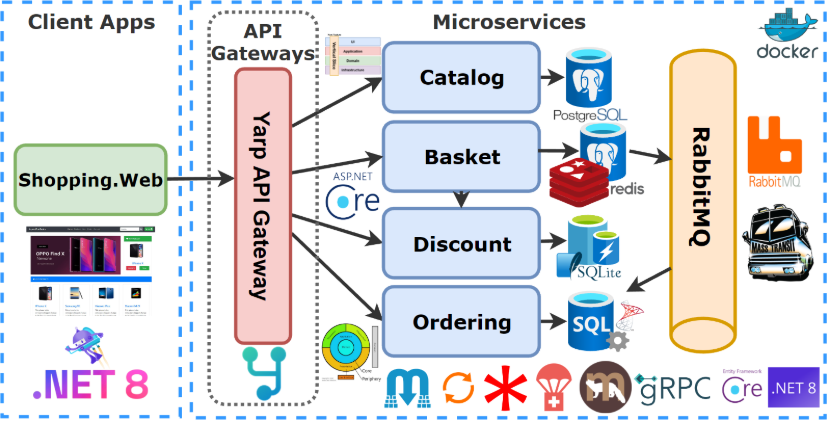
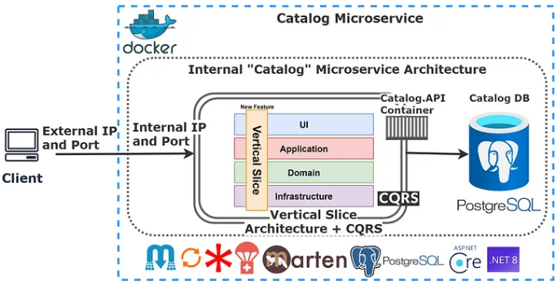
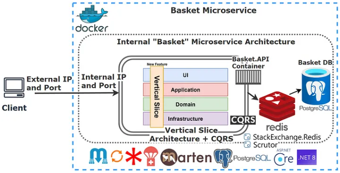
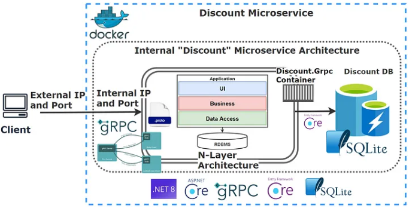
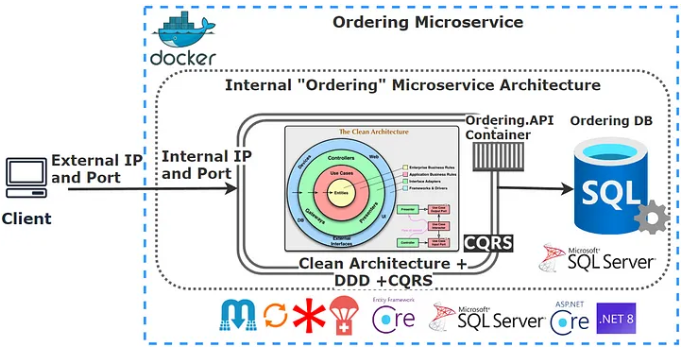
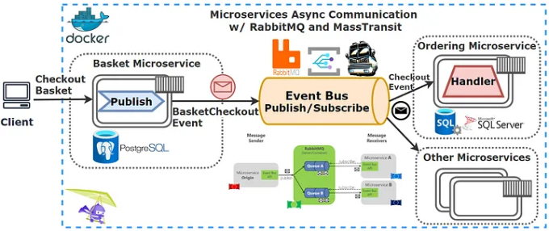
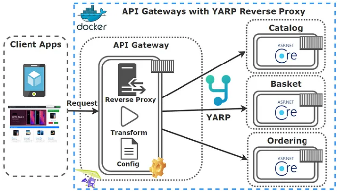
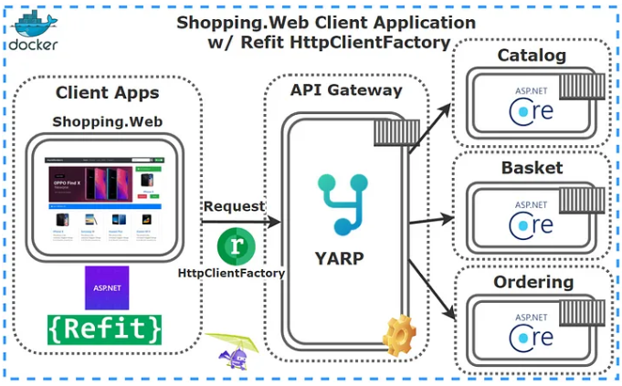
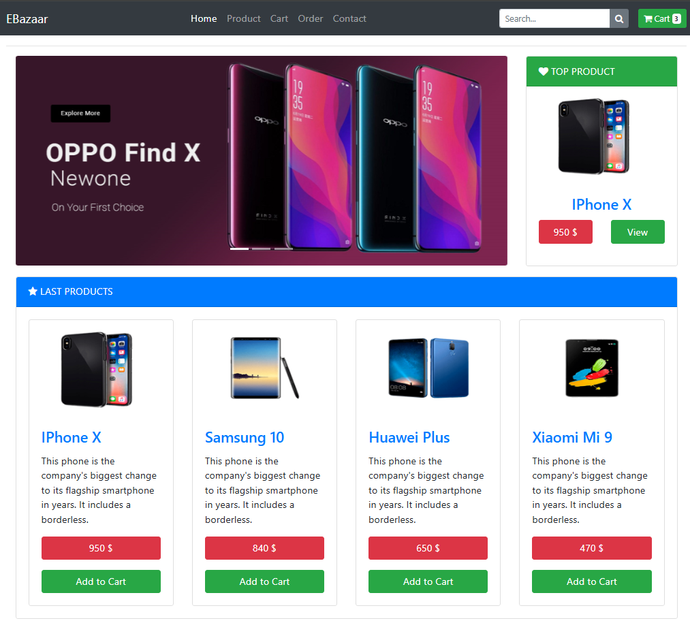

# EBazaar
- A sample e-commerce project that include microservices on .NET platforms which used **ASP.NET Web API, Docker, RabbitMQ, MassTransit, Grpc, Yarp API Gateway, PostgreSQL, Redis, SQLite, SqlServer, Marten, Entity Framework Core, CQRS, MediatR, DDD, Vertical and Clean Architecture** implementation with using latest features of .NET 9 and C# 13 by following [Mehmet Özkaya's Udemy Course](https://www.udemy.com/course/microservices-architecture-and-implementation-on-dotnet/?couponCode=JANU25)

## Features
A couple of microservices which implemented E-Commerce Microservices, those are Catalog, Basket, Discount, Ordering, YarpApiGateway microservices and Ebazaar.Web Client Application.
### Catalog Microservice

- Used **ASP.NET Core Minimal APIs** and latest features of **.NET9** and **C# 13**
- **Vertical Slice Architecture** implementation with **Feature** folders and single .cs file includes different classes in one file
- **CQRS** implementation used **MediatR** library
- **CQRS** Validation **Pipeline Behaviors** with **MediatR** and **FluentValidation**
- Used **Marten** library for **.NET Transactional Document DB** on **PostgreSQL**, so Catalog microservices database will be PostgreSQL but acting as a Document DB using Marten library
- Used **Carter** for **Minimal API** endpoint definition
- **Cross-cutting** concerns **Logging**, **Global Exception Handling** and **Health Checks**
- Implemented **Dockerfile** and **docker-compose** file for running Catalog microservice and PostgreSQL database in Docker environment
- Added **Aspire AppHost** and **ServiceDefaults** file which was not in the course for running **Catalog microservice** and integrating **PostgreSQL** database
### Basket Microservice

- All above Catalog Microservice items into Basket Microservice
- **ASP.NET 9 Web API** application, Following REST API principles, CRUD
- Used **Redis** as a **Distributed Cache** over basket database
- Implemented **Proxy**, **Decorator** and **Cache-aside** patterns
- Consumed **Discount Grpc Service** for inter-service sync communication to calculate product final price
- Published **BasketCheckout Queue** with using **MassTransit** and **RabbitMQ**
- Containerized **Basket Microservice** with **Redis** and **PostgreSQL** database
- Added **Aspire AppHost** and **ServiceDefaults** file which was not in the course for running **Basket microservice** and integrating **PostgreSQL** database and **Redis**
### Discount Microservice

- **ASP.NET gRPC** Service application
- Built a Highly Performant **inter-service gRPC Communication** with Discount and Basket Microservice
- **gRPC** Communications, **Proto files** CRUD operations
- Exposed **Grpc Services** with creating **Protobuf messages**
- **SQLite** database connection and containerization
- **Entity Framework Core ORM** — SQLite Data Provider and Migrations to simplify data access and ensure high performance
- **N-Layer Architecture** implementation
- Containerized **Discount Microservice** with **SQLite** database using Docker Compose
- Added **Aspire AppHost** and **ServiceDefaults** file which was not in the course for running **Discount microservice** and integrating **SQLite** database
### Ordering Microservice

- **ASP.NET Core Web Minimal APIs** for building fast HTTP APIs-fully functioning REST endpoints for CRUD operations
- Implemented **DDD**, **CQRS**, and **Clean Architectur**e with using **Best Practices**
- Applied SOLID Principles, Dependency Injection
- Raised and handled **Domain Events** & **Integration Events**
- **Entity Framework Core Code-First Approach**, **Migrations**, DDD **Entity Configurations**
- **Clean Architecture** implementation on Entity Framework and SQL Server
- Consumed **RabbitMQ BasketCheckout** event queue with using **MassTransit-RabbitMQ Configuration**
- Containerized **Ordering Microservice** with **SQL Server** database and **RabbitMQ**
- Added **Aspire AppHost** and **ServiceDefaults** file which was not in the course for running **Ordering microservice** and integrating **SQL Server** database and **RabbitMQ** for message broker
### Microservices Async Communication w/ RabbitMQ & MassTransit

- **Async Microservices Communication** with **RabbitMQ** Message-Broker Service
- Used **RabbitMQ Publish/Subscribe Topic Exchange Model**
- Used **MassTransit** for abstraction over **RabbitMQ Message-Broker**
- Published **BasketCheckout event** queue from **Basket microservice** and **Subscribed** this **event** from **Ordering microservice**
- Created **RabbitMQ EventBus.Messages library** and added references Microservices
- Containerized **RabbitMQ Message Queue** system with **Basket** and **Ordering** microservices using **Docker Compose**
- Added **Aspire AppHost** file which was not in the course for integrating **RabbitMQ** for message broker system with **Basket** and **Ordering** microservices
### YarpApiGateway Microservice

- Developed **API Gateways** with **Yarp Reverse Proxy** applying **Gateway Routing Pattern**
- **Yarp Reverse Proxy Configuration**; Route, Cluster, Path, Transform, Destinations
- **Rate Limiting** with **FixedWindowLimiter** on Yarp Reverse Proxy Configuration
- Containerized **YarpApiGateway** Microservice using **Docker Compose**
- Added **Aspire AppHost** and **ServiceDefaults** file which was not in the course for running **YarpApiGateway microservice**
### Ebazaar Web Client Application

- **ASP.NET Core Razor Web Application** with Bootstrap 4 and Razor template
- Consumed **YarpApiGateway APIs** using **Refit** Library with **Generated HttpClientFactory**
- **Bootstrap** 4 Theme Implementation
- **ASP.NET Core Razor Tools** — View Components, Partial Views, Tag Helpers, Model Bindings and Validations, Razor Sections etc.
- Containerized Ebazaar **Web Client Application** using **Docker Compose**
- Added **Aspire AppHost** and **ServiceDefaults** file which was not in the course for running Ebazaar **Web Client Application**
### Patterns, Principles, Libraries, Communications, Best Practices
- Implemented different architecture styles: **N-Layer**, **DDD**, **Vertical Slice** and **Clean Architecture**
- Implemented different patterns: **SOLID** Principles, **Dependency Injection** principles, **CQRS** and **Mediator** Pattern, **Options** Pattern, **Proxy** and **Decorator** Pattern, **Publish-Subscribe** Pattern, **Api Gateway** Pattern, **Cache-aside** Pattern
- Implemented different Database types: **NoSQL** and **Relational**: **Transactional DocumentDB**, **PostgreSQL**, **SQLite**, **SQL Server**, **Distributed Caches (Redis)** and Message brokers async communication with **RabbitMQ** and **Masstransit** library
- Used Popular .NET libraries: **Carter**, **Marten**, **MediatR**, **FluentValidation**, **Mapster**, **MassTransit**, **EF Core**, **Refit**
- Implemented different communication styles: **Sync** and **Async** communication between microservices
- Built a **Highly Performant inter-service gRPC Communication** with Discount and Basket Microservice
- Microservices **Async Communication Publish Subscribe Pattern w/ RabbitMQ & MassTransit** for Checkout Basket Between Basket-Ordering Microservices
- Built **API Gateways with Yarp Reverse Proxy** applying **Gateway Routing Pattern**
## Installation
You will need the following tools:
- [Visual Studio 2022](https://visualstudio.microsoft.com/tr/downloads/)
- [.Net Core 9 or later](https://dotnet.microsoft.com/en-us/download/dotnet/9.0)
- [Docker Desktop](https://www.docker.com/products/docker-desktop/)
### Docker
Follow these steps to get your development environment set up: (Before Run Start the Docker Desktop)
1. Clone the repository
2. At the root directory of solution, select **docker-compose** and **Set a startup project**. Run docker-compose without debugging on visual studio.
3. Or you can go to root directory which include docker-compose.yml files, run below command:
    ```bash
    docker-compose -f docker-compose.yml -f docker-compose.override.yml up -d
    ```
4. Launch EBazaar Web UI -> https://localhost:6065 in your browser to view index page.
### Aspire
Follow these steps to get your development environment set up: (Before Run Start the Docker Desktop)
1. Clone the repository
2. Open solution and select **Ebazaar.AppHost** and **Set a startup project**.Run **Ebazaar.AppHost** without debugging on visual studio.
3. Ebazaar.AppHost will launch at https://localhost:17046
4. Wait all containers and projects for running
5. Launch EBazaar Web UI -> https://localhost:5055 in your browser to view index page.
## Usage

1. Browse the homepage and the product page to view available products
2. View product details as clicking the product.
3. Add products to your cart
4. Proceed with the checkout.
5. List orders on the order page.
## License
This project is licensed under the MIT License. See the [LICENSE](./LICENSE) file for more details.
## Author
[Mehmet Akif Yıldız](https://www.linkedin.com/in/mehmet-akif-yildiz/)

If you have any questions or feedback, feel free to reach out!